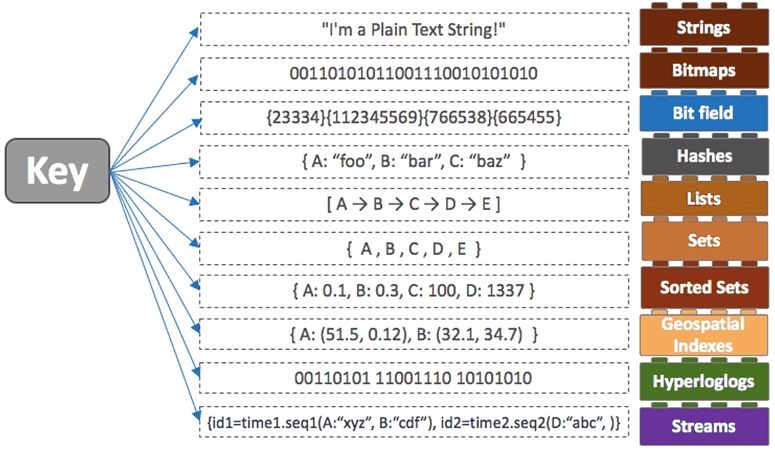
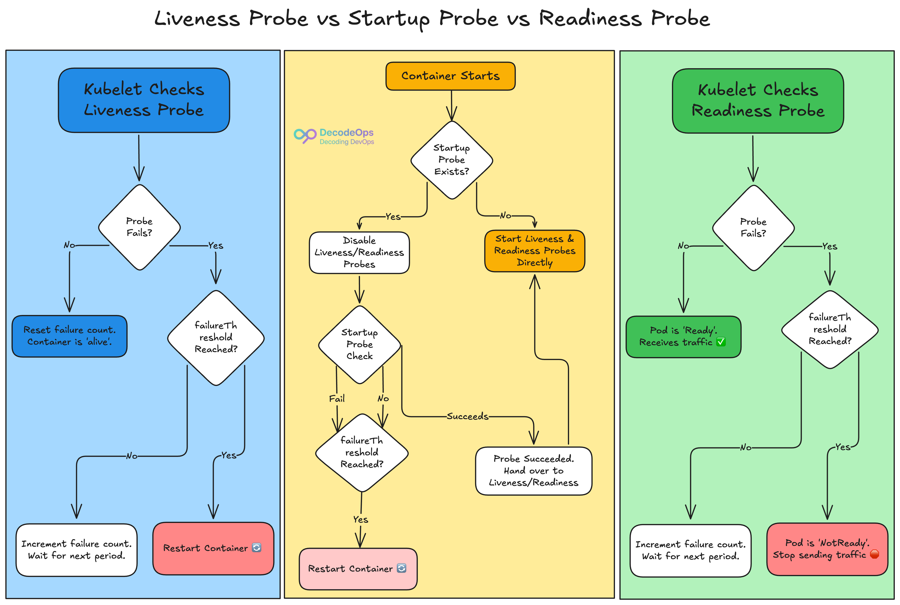
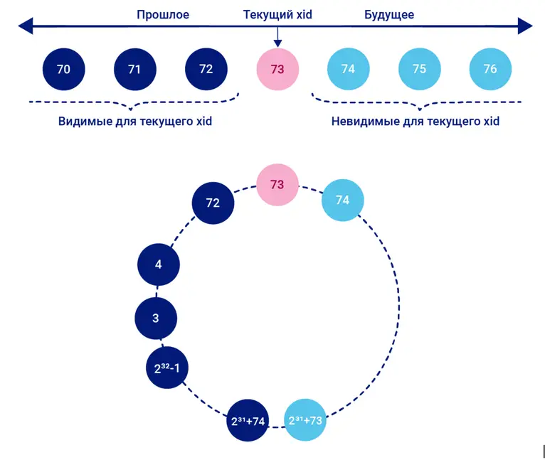
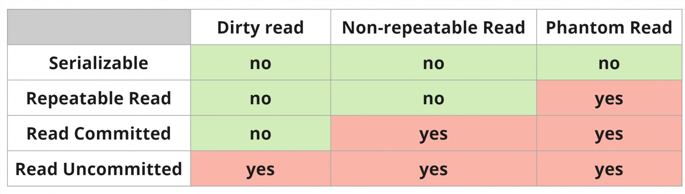
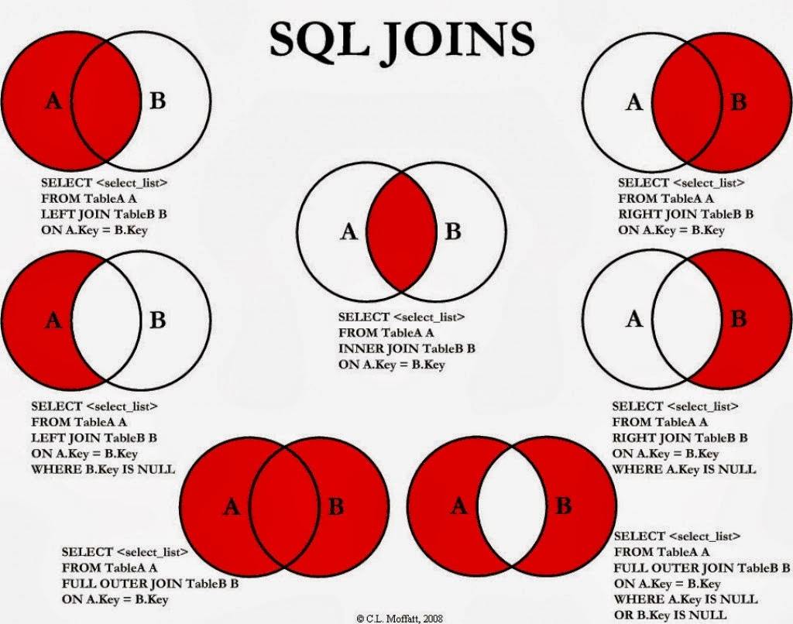

# мониторинг / логи

## графана + логи опенсёрч

У нас есть борды на:

* кафка             - кол-во сообщений в секунду + задержка
* редис             - кол-во запросов в секунду + задержка*
* база              - кол-во запросов в секунду + задержка
* сервисный уровень - кол-во запросов в секунду + задержка
* внешние АПИ       - кол-во запросов в секунду + задержка

Также общие борды:

* infra -> "kube" -> "pods by zabbix"   --  ошибки, цпу, оом
* infra -> "Kubernetes / Views / Pods"  --  цпу, память

## Кеширование

### **in-memory**

**Плюсы:**

* быстрее
* не зависит от внешних источников
* отказоустойчивей

**Минусы:**

* нужда в синхронизации
* больше памяти
* сложно тестировать из вне
* нужна в прогревании при старте

### **redis**

#### Инвалидация кеша

1. TTL
2. LRU - Least recently used
3. LFU - Least frequently used
4. Random replacement
5. FIFO - First in, first out

#### Типы в редисе



**Плюсы:**

* централизованность
* не зависит от приложения
* меньшее потребление памяти
* проще тестировать из вне

**Минусы:**

* медленнее ин-мемори из-за оверхеда сети
* зависит от сети
* однопоточный

## **Отказоустойчивость**

* Сервисы подняты в нескольких подах в разных кластерах
* Лоад балансер
* Ретраи
* Inbox
* Outbox
* Dead letter queue

## **Идемпотентность**

* Кафка - партиции + коммиты
* Сервисы - схема master от Санжи
* Кронтаски - шедлок advisory_lock в постгре
* HTTP - лоад балансер
* Дедупликация

## **Параллельная обработка**

* Кафка - партиции через мурмур
* Сервисы - обработка по шардам а-ля баланс

## Пробы в куберах

1. Liveness Probe - жива ли пода в принципе?
2. Readiness Probe - ждёт старта приложение т.е. старта сервера

    Сделано для прогрева кешей, подключения к базам, миграциям и т.д. до того как в поду пойдёт трафик.
3. Startup Probe - дополнительная проба до `liveness` и `readiness`, редко используется.



## **Процесс пересоздания поды и консумера**

1. Запускается новая пода
2. Кубер пингует лайв пробу
3. Создаёт консумера
4. При попытке вычитать - аутентификация, получение партиций и т.д.
5. Кубер убивает старый под
6. Graceful shutdown через контекст
7. Любая обработка в транзакции отменяется по контексту
8. Закрываем консумера
9. Ребаланс кафки
10. Новый консумер начинает читать

## **Go**

### Интересные фичи Go в последних версиях

`1.23` - итераторы

`1.24` - новая имплементация мап - `swiss tables`

`1.25` - автоматическое проставление `GoMaxProcs` с учётом контейнеризации, новый экспериментальный `GC Green Tea`

### Escape analysis

Это анализ того куда уйдут переменные - в хип или в стек.

Можно посмотреть сделав `go build -gcflags '-m'`

1. Возвращаем новый поинтер из функции

    ```go
    // escape
    func getUser(id int) *User {
        return &User{ID: id, Name: "Anonymous"} // <-------------
    }
    // no escape
    func getUser(id int) User {
        return User{ID: id, Name: "Anonymous"} // <--------------
    }
    ```

2. Используем переменные в анонимных функциях без передачи в аргументы

    ```go
    // escape
    func processItems(items []int) {
        for _, item := range items {
            go func() {
                fmt.Println(item) // <---------------------------
            }()
        }
    }
    // no escape
    func processItems(items []int) {
        for _, item := range items {
            go func(n int) {
                fmt.Println(n) // <------------------------------
            }(item)
        }
    }
    ```

3. Слайсы без преаллокации

    ```go
    // escape
    func buildSlice(n int) []int {
        var s []int // <-----------------------------------------
        for i := 0; i < n; i++ {
            s = append(s, i)
        }
        return s
    }
    // no escape
    func buildSlice(n int) []int {
        s := make([]int, 0, n) // <------------------------------
        for i := 0; i < n; i++ {
            s = append(s, i)
        }
        return s
    }
    ```

### Утечки памяти

Как задетектить утечку памяти: графана или смэрть от ООМ

Как найти и устранить причину утечки: `debug/pprof`

### Синхронизация

Как безопасно обновить глобальную переменную:

* Простой int - атомик
* Сложная структура - mutex.

### GoMaxProcs

* `GoMaxProcs` - макс кол-во `P` по модели `G/M/P` - `goroutine`, `machine - os thread`, `processor - queue of G`.  
  В 1.25 в контейнерах работает автоматически
* Почему `GoMaxProcs > ContainerMaxProcs` плохо - переключение тредов ОС дороже переключения горутин между собой.
* `cpu: "250m"` - 25% одного ядра

### Гонки данных

* Можно поискать сделав `go run . -race`

1. Рантайм мониторит все участки памяти.
2. Есть ли больше 1 попытки доступа к переменной?
3. Есть ли хотя бы 1 write этой переменной?
4. Использовались ли примитивы синхронизации: мьютексы, каналы и т.д. ?
5. Если ответы да, да, нет - дата рейс

### sync.Pool

[Подробные примеры](https://dev.to/jones_charles_ad50858dbc0/mastering-gos-syncpool-avoid-the-traps-boost-your-code-i9b)

Пул это хранилище объектов куда можно класть преаллоцированные объекты и переиспользовать их, тем самым уменьшая кол-во лишних аллокаций

**Плюсы:**

1. Уменьшение кол-ва аллокаций
2. Уменьшение кол-ва вызовов GC

**Минусы:**

* Пул не вечен - GC будет время от времени его чистить; если во время интенсивной нагрузки он это сделает, то будет куча новых аллокаций и как следствие просадка производительности
* Перед тем как вернуть объект в пул, нужно его "отчистить".

  Например в `[]byte` размером `1024` нужно обнулить все значения в лупе

    ```go
    buf := bufPool.Get().([]byte)
    defer func() {
        for i := range buf {
            buf[i] = 0
        }
        pool.Put(buf)
    }()
    doSomething(buf)
    ```

* Ухудшение производительности если для пула выбраны неверные объекты
* Отсутствие гарантий безопасности между горутинами:

    `Get()` и `Put()` безопасны в контексте пула, но сам объект не защищён

    2 горутины могут получить референс на 1 и тот же объект и будут дата рейсы

    Решение - мьютексы в объекте или использование атомиков при манипуляциях объектом

**Как понять что нужно пулить:**

1. Объект > 1KB
2. Частое использование
3. В других случаях не стоит

### Поинтеры

Когда использовать:

1. Мутация напрямую, например в методах
2. Синглтоны - приложение, сервис и т.д.
3. Конны - база, редис и т.д.
4. Если очень большие структуры и копировать их дорого
5. Репрезентация `null` в базах данных т.е. `*int` (`1` или `nil`) вместо (`1` или `0`)

### Уменьшение кол-ва аллокаций

* Не делать конкатенацию строк, использовать стринг билдер
* По возможности копировать поинтеры, кроме мап / слайсов т.к. там и так поинтер
* Преаллокация слайсов / мап
* `sync.Pool`

### Почему строки иммутабельные?

* Т.к. строка - массив байт, любое изменение может привести к аллокации нового массива.
* Лишняя логика для мутации которая по сути и есть в `strings.Builder`
* Иммутабельность даёт возможность использовать строки в качестве ключа в мапах
* Иммутабельность отсекает возможность гонок данных
* Иммутабельность позволяет использовать один и тот же кусок памяти для ссылок, как напрямую так и через слайсы

## Базы данных

**DELETE:** is basically a row level operation. A DELETE statement will mark every row matching the WHERE-clause as deleted. In the case of billions of rows, this takes a relatively long time.

**TRUNCATE:** is basically a table operation. Instead of touching each row separately, it will simply empty the entire table and start a new data file.

### EXPLAIN ANALYZE

* Общее время выполение запроса
* Тайминг разных операций
* Кол-во строк обработанных в каждом шаге
* "Стоимость" запроса и его частей

**EXPLAIN:**

Просчитывает запрос и помогает увидеть тайминги и метрики запроса **БЕЗ ВЫПОЛНЕНИЯ ЗАПРОСА**.

**ANALYZE:**

Обновляет статистику для всех таблиц в базе данных для планировщика

**EXPLAIN ANALYZE:**

Помогает увидеть реальные тайминги и метрики запроса **С ВЫПОЛНЕНИЕМ ЗАПРОСА**.

Поэтому нужно оборачивать команду `EXPLAIN ANALYZE` в транзакцию и откатывать, чтобы данные в БД не изменились.

---

### Виды индексов

#### B-tree

```sql
CREATE INDEX ix_example_btree ON example_table (column_name);
```

Наиболее распространённый тип индекса. Подходит для запросов на равенство и диапазон.

Поддерживает отсортированные данные, что делает его эффективным для извлечения упорядоченной информации

**Особенности**:

* Поддерживает все стандартные операции сравнения (>, <, >=, <=, =, <>).
* Может использоваться для сортировки, ограничений уникальности и поиска по диапазону значений.
* Может ускорить запросы, использующие не все поля индекса, а какую-то их часть.

---

#### Hash

```sql
CREATE INDEX ix_example_hash ON example_table USING hash (column_name);
```

Используется для простого сравнения на равенство по хешу ключа.

**Особенности**:

* Может строиться только по одному столбцу и не позволяет проверять уникальность.
* Поддерживает только оператор =, поэтому для предложений WHERE, в которых фигурируют проверки интервалов, хеш-индексы будут бесполезны.
* Каждый кортеж хеш-индекса хранит только 4-байтовое хеш-значение, а не фактическое значение столбца.

---

#### GiST

```sql
CREATE INDEX ix_example_gist ON example_table USING gist (to_tsvector('english', column_name));
```

Предназначен для работы с сложными типами данных.

Организует данные в виде дерева поиска, каждый узел в дереве представляет пару «ключ — значение», где ключ — индексируемое значение, а значение — указатель на фактические данные.

**Особенности**:

* Может обрабатывать типы данных, например, точки, полигоны, коробки и другие геометрические формы.
* Поддерживает широкий спектр индексируемых операторов для каждого типа данных.
* Помогает оптимизировать запросы, которые включают поиск, фильтрацию или объединение по индексированным данным.

---

#### GIN

```sql
CREATE INDEX ix_example_gin ON example_table USING gin (to_tsvector('english', column_name));
```

Инвертированный индекс. Предназначен для ускорения поиска в структурах данных, содержащих составные типы. По своей сути, это обратный индекс, где для каждого уникального элемента хранится список указателей на записи, в которых он встречается.

**Особенности**:

* Особенно эффективен для массивов (хранение списков значений, быстрый поиск по элементам массива), JSONB (хранение полуструктурированных данных, быстрый поиск по ключам и значениям), полнотекстового поиска (индексация текстовых полей, быстрый поиск по словам и фразам).
* Значение каждого ключа хранится только один раз, что делает индекс GIN компактным в случаях, когда один ключ встречается много раз.

---

### CQRS - Command Query Responsibility Segregation

Разделение логики в мастере и репликах.

Пишем в мастер, читаем из реплик.

---

### N+1 проблема в ORM

Возникает из-за неэффективной выборки связанных данных т.е. вместо одного эффективного SQL-запроса выполняется N+1 запрос

1. Один запрос (1) получает список основных объектов.
2. Затем для каждого объекта из списка выполняется ещё N запросов, чтобы получить связанные данные.

**Причины:**

1. Выборка списка родительских объектов, а затем выполнение отдельного запроса для каждого родителя для выборки связанных дочерних объектов
2. Вложенные циклы в запросах: PostgreSQL сканирует одну таблицу, и для каждой найденной строки сканирует другую таблицу
3. Устаревшая статистика запросов, таблиц и колонок мешает планировщику постгри

**Решения:**

1. Использовать `JOIN`
2. Использовать `WITH (CTE)`
3. Анализ запросов через `EXPLAIN ANALYZE`
4. Выполнить `ANALYZE` для обновления статистики

### Колоночные базы данных - клик

Каждая колонка - отдельный файл

**Плюсы:**

* Компрессия однородных данных
* Быстрые `select` запросы
* Хорошая для аналитики

**Минусы:**

* Медленнее работа с `OLTP (Online Transaction Processing)` т.е. большое кол-во маленьких транзакций типа
 `insert` или `update` на 1 строку. В частности конкурентная обработка данных, денежные операции и т.д.
* Занимает больше места на диске

### Строковые - постгря

Таблицы хранятся в страничках по 8КБ, настраивается

### Дедлоки в постгре

Это когда 2 или более транзакции лочат один кусок таблицы и не могут ничего сделать т.к. ждут пока отпустят лок.

TX1 держит лок на ресурс который нужен TX2
TX2 держит лок на ресурс который нужен TX1

При дедлоке постгря выбирает какую из них отменить

В случае когда всего 2 транзакции:

* Какая из двух сделала меньше изменений
* Какая из них меньше живёт

Отменяется менее важная, более важная продолжает работу

В случае когда больше 2 транзакций - выбирается минимальное кол-во транзакций после отката которых остальные могут закончить работу корректно.

Как это предотвратить:

* Более мелкие транзакции
* Более очерёдный порядок создания транзакций
* Дизайн приложения
* advisory_lock если логика позволяет

### TOAST

Более эффективное хранение жирных колонок (~ >2KB) с помощью компрессии

Используется автоматически

**Плюс:**

* Помогает уменьшить кол-во места которое занимает жирные поля типа `jsonb` или `text`

**Минус:**

* Из-за компрессии и декомпрессии + хранения в другом участке памяти - оверхед производительности.

### WAL - Write-Ahead Logging

Запись данных в журнал перед изменением базы данных:

При изменении данных в базе данных PostgreSQL сначала записывает эти изменения в журнал транзакций (WAL)
на диск, а затем применяет изменения в основной базе данных. Это гарантирует, что в случае сбоя базы
данных можно будет восстановить её состояние.

**Плюсы:**

1. Защита данных
2. Быстрая репликация

**Минусы:**

1. Снижение производительности инсёртов, апдейтов
2. БОльшее потреблению диска из-за WAL файлов
3. Потребность чистить / архивировать WAL файлы

### MVCC - Multiversion Concurrency Control

Каждая транзакция видит "снепшот/снимок" базы данных на момент своего начала

Когда транзакция изменяет данные они не перезаписываются, а создаётся новая версия изменённых строк



Каждая версия строки имеет специальные метки:

xmin — идентификатор транзакции, которая создала версию

xmax — идентификатор транзакции, которая удалила (или обновила) версию

### Нормализация данных

#### Формы нормализации

**1NF** — каждая ячейка таблицы содержит только одно значение, отсутствуют повторяющиеся группы.

**2NF** — таблицы не содержат частичных зависимостей атрибутов от составного ключа.

**3NF** — устранение транзитивных зависимостей между неключевыми атрибутами.

**Плюсы:**

* Предотвращает избыточность и повышает целостностность данных
* Повышает масштабируемость
* Упрощает управление данными, например CASCADE

**Минусы:**

* Повышенная сложность в проектировании
* Накладные расходы на производительность

### В чём преимущество денормализованных данных?

Денормализация снижает необходимость в джойнах и позволяет улучшить как производительность запросов, так и их написание и поддержку.

### Уровни изоляции транзакций



#### **READ UNCOMMITTED**

Транзакция может видеть результаты других транзакций, даже если они ещё не закоммичены.

Основные аномалии:

* `Dirty Read (грязное чтение)` - когда данные, которые я прочитал, кто-то может откатить ещё до того, как я завершу свою транзакцию
* `Non‑repeatable Read (неповторяющееся чтение)` или `Fuzzy Read` - когда данные, которые я прочитал, кто‑то может изменить ещё до того, как я завершу свою транзакцию
* `Phantom Read (фантомное чтение)` - когда ряд данных, которые я прочитал, кто‑то может изменить до того, как я завершу свою транзакцию.

Дополнительные:

* `Lost Update (потерянное обновление)` - когда две транзакции одновременно читают и изменяют одни и те же данные, и при этом одно из изменений может потеряться.
* `Out‑of‑order Read (неупорядоченное чтение)` - когда несколько чтений выполняются в произвольном порядке, что может привести к неправильным результатам в транзакциях.

#### **READ COMMITTED**

Дефолтный уровень изоляции в postgres - транзакция может читать только те изменения в других параллельных транзакциях, которые уже были закоммичены

Спасает от `грязного чтения`, но не от `неповторяющегося чтения`, `фантомного чтения`, `потерянного обновления` или `неупорядоченного чтения`

#### **REPEATABLE READ**

Пока транзакция не завершится, никто параллельно не может изменять или удалять строки, которые транзакция уже прочитала

Спасает и от `грязного чтения`, `неповторяющегося чтения`, `потерянного обновления` и `неупорядоченного чтения`, но не от `фантомного чтения`

#### **SERIALIZABLE**

Блокирует любые действия, пока запущена транзакция.

Спасает от всего.

Примеры использования:

```sql
--Будет действовать на 1 следующую транзакцию в текущей сессии
SET TRANSACTION ISOLATION LEVEL REPEATABLE READ;

--Будет действовать на все транзакции в текущей сессии
SET SESSION TRANSACTION ISOLATION LEVEL REPEATABLE READ;

--Будет действовать на все транзакции
SET GLOBAL TRANSACTION ISOLATION LEVEL REPEATABLE READ;
```

### Joins



### SELECT ... FOR UPDATE

Лочит поле для апдейта в будущем в контексте транзакции
Помогает с целостностью данных, но может привести к б*о*льшему количеству дедлоков

```sql
BEGIN;

SELECT * FROM accounts
WHERE account_id = 1
FOR UPDATE; -- locks account_id

UPDATE accounts
SET balance = balance - 100
WHERE account_id = 1;

COMMIT;
```

### CTE (Common Table Expressions)

Нужны для упрощения сложных запросов.

Это временный результат запроса, который можно использовать в основном запросе.

Пример использования:

Eсли есть таблица employees, содержащая информацию о сотрудниках и их менеджерах, чтобы найти всех подчинённых конкретного менеджера, можно использовать рекурсивный CTE

**Плюсы:**

* Упрощение кода - CTE позволяет разбивать сложные запросы на более понятные части
* Повторное использование данных - можно обращаться к CTE несколько раз в основном запросе, избегая дублирования кода
* Ускорение работы с рекурсией - CTE позволяет выполнять рекурсивные запросы, что полезно для обработки иерархических данных (например древовидных структур)

**Минусы:**

* CTE не сохраняется в памяти между запросами - он существует только в рамках одного выполнения SQL-команды
* В некоторых случаях производительность CTE может быть ниже, чем у подзапросов или временных таблиц, особенно если PostgreSQL не оптимизирует его повторное использование
* Проблемы с оптимизацией - запросы с CTE обычно сложнее оптимизировать, чем эквивалентные запросы без CTE. Для оптимизации таких запросов важно тщательно анализировать план выполнения
* Ресурсоёмкость - CTE хранят в кэше временную структуру данных, к которой постоянно обращается как основной запрос, так, возможно, и само табличное выражение

### Оконные функции

Окно - это некоторое выражение, описывающее набор строк, которые будет обрабатывать функция и порядок этой обработки.

В качестве функции можно использовать, так сказать, истинные оконные функции из мануала — это `row_number()`, `rank()`, `lead()`, `lag()` и т.д., а можно использовать функции-агрегаты, такие как: `sum()`, `count()` и т.д.

```sql
SELECT
    id,
    section,
    header,
    score,
    row_number() OVER (PARTITION BY section ORDER BY score DESC)  AS rating_in_section
FROM news
ORDER BY section, rating_in_section;
```

 id | section |  header   | score | rating_in_section |
----|---------|-----------|-------|-------------------|
  2 |       1 | Заголовок |     6 |                 1 |
  6 |       2 | Заголовок |    95 |                 1 |
  5 |       2 | Заголовок |    34 |                 2 |
  1 |       2 | Заголовок |    23 |                 3 |
  4 |       3 | Заголовок |    36 |                 1 |
  8 |       3 | Заголовок |    36 |                 2 |
  3 |       4 | Заголовок |    79 |                 1 |
  7 |       4 | Заголовок |    26 |                 2 |

### advisory_lock

#### **Блокирующие**

1. Сессия - релиз через вызов анлока или при обрыве соединения.

    `pg_advisory_lock(key)`

    `pg_advisory_unlock(key)`

2. Транзакция - релиз автоматически после коммита/роллбека транзакции.

    `pg_advisory_xact_lock(key)`

#### **Не блокирующие**

1. Сессия - релиз через вызов анлока или при обрыве соединения.

    `try_advisory_lock(key)`

    `pg_advisory_unlock(key)`

2. Транзакция - релиз автоматически после коммита/роллбека транзакции.

    `try_advisory_xact_lock(key)`

## Kafka

### Распределение партиций - как понять сколько нужно

* Кол-во партиций > кол-во ридеров - чтобы не простаивать
* Кол-во партиций должно быть кратным кол-ву ридеров для равномерного распределения данных
* В зависимости от типа данных - жирные или не жирные, потока данных и т.д.
* positions_all - много данных, относительно жирных - большее кол-во партиций помогает с параллелизмом
* office_info - мало данных, жирные - меньшее кол-во партиций

### Почему очень большое кол-во партиций - плохо

* Большое потребление памяти на сервере
* Каждая партиция лишний хендлер файла на сервере
* Большое потребление памяти у клиента т.к. каждая партиция отдельная структура
* Сложное обслуживание
